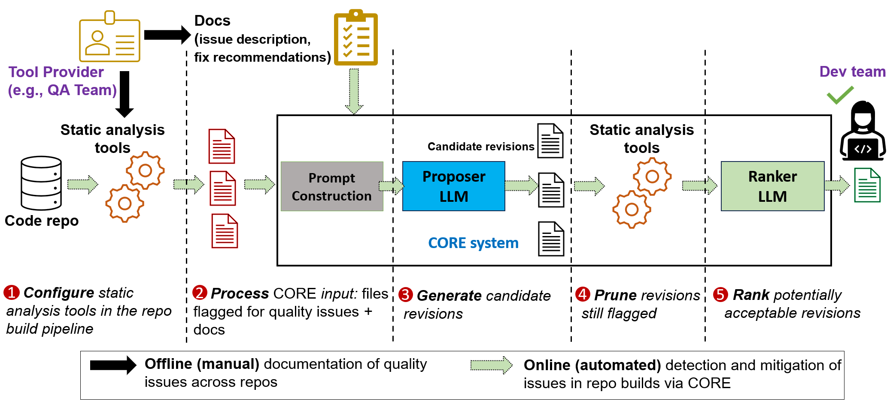

# COde REvisions (CORE) 

CORE is a pipeline that can fix code quality issues flagged by your favourite Static Analysis tool.

CORE out of the box supports 52 Python CodeQL checks and 10 Java SonarQube checks. You can find our research paper at our [webpage](https://aka.ms/COREMSRI).

We also add the Supplementary Material (Appendix) for our paper.

## Details

The pipeline involves 6 main files `run_llm_proposer.py`, `run_codeql_verifier.py`, `run_analysis.py`, `get_diffs.py`, `run_llm_ranker.py` and `get_results.py` which are to be run in corresponding order. The templates used by the proposer and the ranker are in `templates` dir. The metadata for 52 Python CodeQL queries and the 10 Java SonarQube checks are in `metadata` dir. 

The `run_llm_proposer.py` takes input the files needed to be modified, a csv report generated by CodeQL and some metadata about the CodeQL checks (as shown in the `metadata/python/metadata.md`) 

To add your own Static Analysis tool, the information required for the proposer and the ranker are given in the metadata files. You will also need to implement stage 4 of the pipeline to prune revisions (refer to `run_codeql_verifier.py` and `run_analysis.py`)

## Getting started

### Prerequisites 

CORE currently only supports Linux (We are in the process of making it available on more platforms). Our scripts will help you setup CORE for CodeQL however you can setup and use CORE with you favourite Static Analysis tool. You will also need `python 3.11` with the requirements mentioned in `requirements.txt` file.

CORE also currently employs **GPT-3.5-Turbo** for the Proposer LLM and **GPT-4**. In our research we used **GPT-3.5-Turbo-16k-0613** and **GPT-4-0613** to gather the results and performance, which the proposer and ranker default to. However OpenAI has updated GPT-3.5-Turbo and GPT-4 since then. Thus performance on newer models may differ from that reported in the paper.

Add a `.env` file in the project directory with the following information

```env
OPENAI_API_KEY=<your openai api key>
```

### Setting up CORE
Clone the repo in the desired location.

```bash
# Clone the repository
git clone <url>
```
Then enter the repo folder and run all following commands from the project directory.

Next, setup a new python environment with requirements mentioned in `requirements.txt`. We describe steps using `conda`.

```bash
# Create a new python environment
conda create -n CORE python=3.11 -y

# Activate to new python environment
conda activate CORE

# Install requirements
pip install -r requirements.txt
```

### Setting up CodeQL
The `codeql-setup.sh` script will install **CodeQL (v2.5.0)** in a new directory in the project directory `codeql-home` alongside the needed ql packs for the 52 checks. Run the script as follows while in the project directory.

```bash
# Run the codeql-setup script
bash codeql-setup.sh
```

> Note: You can edit the script to install codeql at your preferred location, However ensure that you also reflect similar changes to following `run_CORE_pipeline.sh` script (while running `verifier.py`)

> Note: We use CodeQL v2.5.0 since the our datasets were made on that version. Feel free to use any different/newer version of CodeQL for your usecase.

### Dataset for CORE Pipeline

During our research and development of CORE, we created the **CQPy**, **CQPyUs** and the **SQJava** dataset which we have zipped and kept in the `dataset` folder. You can know more about the format and structure of them at [dataset directory](dataset/README.md)

Unzip the dataset within the dataset directory.
```bash
tar -xvf dataset/CQPyUs.tar.gz -C dataset
```

### Running the CORE Pipeline

The CORE pipeline primarily involves 2 main files, `src/run_llm_proposer.py` (Proposer LLM) and `src/run_llm_ranker.py` (Ranker LLM). These correspond to stage 2 and 3, and stage 5 in the CORE pipeline.



We also additionally run `src/run_codeql_verifier.py` to prune the proposed revisions using CodeQL, `src/run_analysis.py` which collects and summarizes results from CodeQL logs, `src/get_diffs/py` that create diffs for Ranker LLM and `src/get_results.py` to compile and respond with results of the pipeline.

The `scripts/run_CORE_pipeline.sh` describes running the whole pipeline over the CQPy dataset over a single query ([Redundant comparison](https://codeql.github.com/codeql-query-help/python/py-redundant-comparison/) in the script). It creates a `debug/CQPyUs_results` folder in the project directory with multiple folders as results from all files mentioned above. The final results are stored in `results.json` and `results` dir in the `debug/CQPyUs_results` dir.


```bash
bash scripts/run_CORE_pipeline.sh
```

>Note: You can edit the variables in `scripts/run_CORE_pipeline.sh` to change the location of the temp folder, dataset used and the CodeQL query run (remove the `--Queries` flag to run over all queries).

>Note: You can also set other arguments in each of the files to change different aspects of the pipeline.

## Releases

This is just an initial release where we make the code from the research public. 
 
## Contributing

Contributions are welcome! Feel free to open issues on this GitHub repository, and also to open pull requests for making this project nicer.